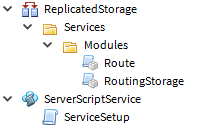

# Custom ROBLOX Services

This is a system for creating your own custom services in ROBLOX.

ROBLOX comes with an assortment of built in services, but games are complex and require lots of specialized handling. The built in services can't account for every scenario, which is where custom services come in.

Custom services are designed to give you seamless client-server communication, with the added benefit of modularizing your boilerplate code to reduce the size of your script files.

## Basic Service Definition

A service in its simplest form looks like this:

```lua
local run = game:GetService("RunService")

if run:IsServer() then
  local service = {}

  function service:Greet(player)
    print("Hello, " .. player.Name .. "!")
  end

  return service
else
  local route = require(script.Parent.Modules.Route)
  return route(script)
end
```

The server is returned a plain table that makes up the service, while the client is returned a router. The router handles client-server communication.

All services are initialized on the server. When a service is required from the client, all requests are routed to the server. You only ever have to worry about updating the service on the server to have all future requests from the client updated.

## Installing

Copy/paste the contents of each file under `src` to their respective locations in the ROBLOX Explorer. When you're done, it should look like this:



With everything installed, you can add services to `ReplicatedStorage.Services`. Keep in mind that these must be ModuleScripts with `Service` at the end of their names (case insensitive).

## Basic Usage

After going through the install steps above, we're ready to start coding some services! Add a new `ExampleService` with the following code:

```lua
-- ReplicatedStorage.Services.ExampleService
local run = game:GetService("RunService")

if run:IsServer() then
  local service = {}

  function service:GetHyped(str)
    return string.upper(str) .. "!!"
  end

  return service
else
  local route = require(script.Parent.Modules.Route)
  return route(script)
end
```

Using the service is the same on both the server and client. For the purposes of this example we'll be requiring the service client-side to introduce you to [routing](#routing).

Put the following in a LocalScript:

```lua
-- StarterPlayer.StarterPlayerScripts.ClientUsage
local replicatedStorage = game:GetService("ReplicatedStorage")
local example = require(replicatedStorage.Services.ExampleService)

print(example:GetHyped("Hello World"))
```

You simply require the service like any other ModuleScript and you're good to go, whether you're on the server or client.

Now it's time to test things out. To ensure everything will work when you publish your game, start a test server with at least one player. (The reason for this is explained in [Pitfalls](#pitfalls).)


If everything worked, your output should look like this:


You can also add properties to your service, just like any other table. Go back to `ExampleService` and change the following:

```lua
[...]
local service = {
  Excitement = "!!"
}

function service:GetHyped(str)
  return string.upper(str) .. self.Excitement
end
[...]
```

<!-- TODO Remove when property routing is added -->
Keep in mind that `Excitement` can only be indexed by the server. Currently there is no property routing, so any attempts to index `Excitement` in your client code will only work in Play mode. On a test server or online, `Excitement` will be `nil`. See [Pitfalls](#pitfalls) for more details.

That's all you need to know for basic usage. Be sure to familiarize yourself with [routing](#routing) you start creating more services. There's very important info on why you create services in certain ways, and what you have to avoid.

## Routing

Routing is how we allow the client to interact with services and seamlessly communicate with the server.

Using the code from the [Basic Usage](#basic-usage) section, we're going to take a look at what happens behind the scenes. We're going to be using the `ExampleService` we made earlier:

```lua
local run = game:GetService("RunService")

if run:IsServer() then
  local service = {}

  function service:GetHyped(str)
    return string.upper(str) .. "!!"
  end

  return service
else
  local route = require(script.Parent.Modules.Route)
  return route(script)
end
```

You'll notice that we return something different depending on where the service is required from. When required from the server, the service's table is returned like a normal module.

However, on the client we pass the service module into the `route` function. What this function does is return a new table with methods that have the same names as those in `service`, pointing to RemoteFunctions.

These RemoteFunctions are created at the start of the game by `ServiceSetup`. Any time you call a service's method from the client, you're actually invoking one of these RemoteFunctions that tells the server to run the method in the service.

This is the routing we do to allow for an identical API and seamless usage between the server and client.

### Pitfalls

While this system comes with the benefit of giving us an easy way to communicate between the server and client, it comes with some caveats you should be aware of:

- **Play mode is not guaranteed to give you the same results as online.**

  When testing your game in Play mode (that is, when you load in your ROBLOX character locally), there is no difference between the server and client. Because of this, we have to return the service's table to LocalScripts, instead of the router.

  This is only an issue if you don't avoid the other pitfalls. You're free to use "Run" and "Play" for testing, but before you publish your game you should always run a test server to make sure everything will work online.

- **Never set values of properties from the client.**

  This is to do with the above pitfall. Because we have to return the service's table to the client in Play mode, anything the client modifies will change the service for all scripts. (This behavior doesn't effect online.)

  If you need the client to modify a property of the service, create a method for that purpose.

<!-- TODO Remove when property routing is added -->
- **There is currently no property routing.**

  This means if your service has the property `Name`, this can only be indexed by the server. You would need a method in the service to get this property from the client. For example:

  ```lua
  -- ReplicatedStorage.Services.PropertyWorkaroundService
  local run = game:GetService("RunService")

  if run:IsServer() then
    local service = {
      Name = "PropertyWorkaroundService"
    }

    function service:GetName()
      return self.Name
    end

    return service
  end
  ```

  And on the client:

  ```lua
  -- StarterPlayer.StarterPlayerScripts.GetServiceName
  local replicatedStorage = game:GetService("ReplicatedStorage")
  local service = replicatedStorage.Services.PropertyWorkaroundService

  -- Prints "nil" when in a test server or online.
  print(service.Name)
  -- Prints "PropertyWorkaroundService", whether you're in Play mode, a test server, or online.
  print(service:GetName())
  ```
